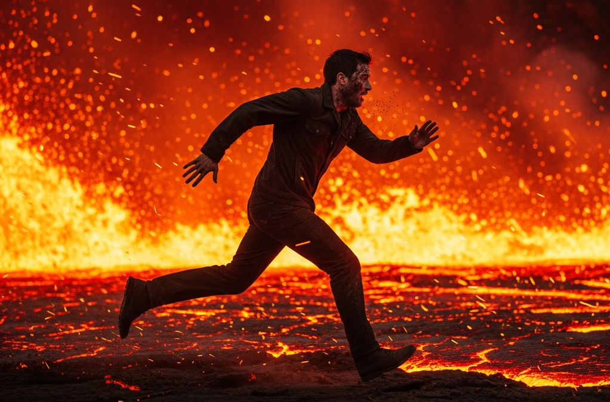
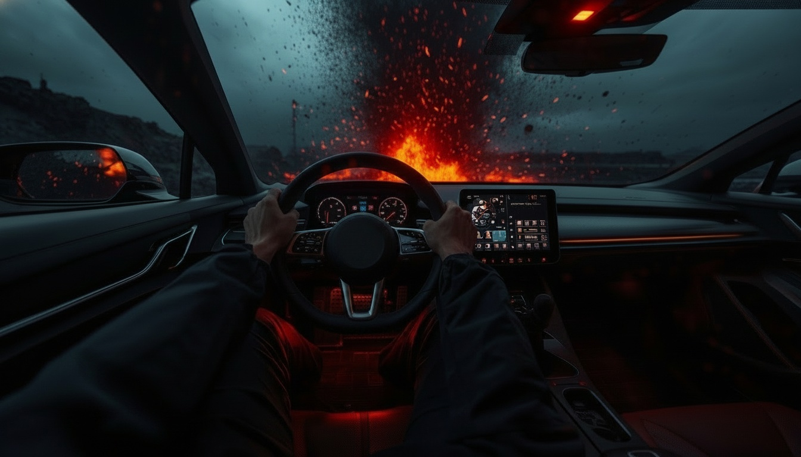
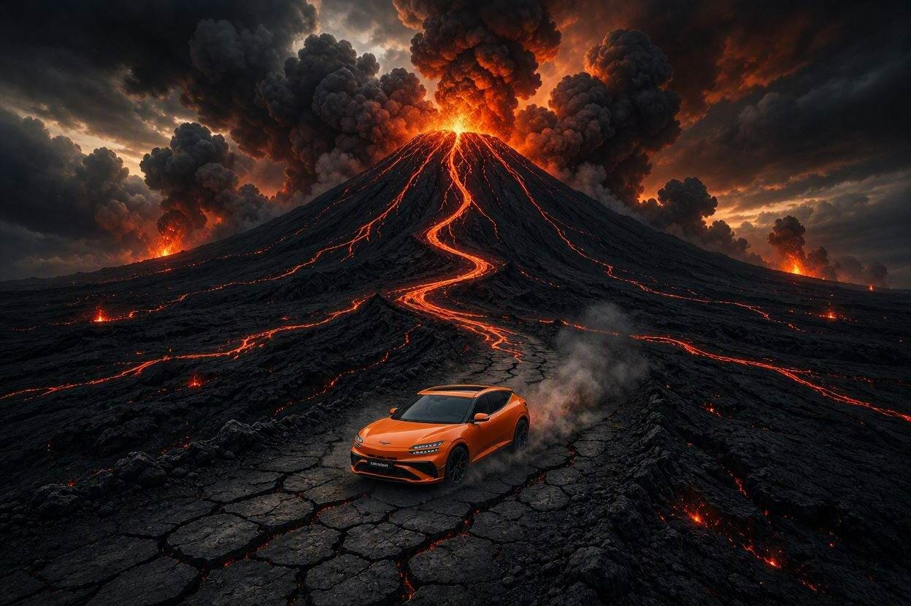

# 📁 스토리보드 기획서

---

---

# 📌 1. 브랜드 아이덴티티

- 브랜드명: 현대 GENESIS GV60 마그마
- 타겟: 30~40대(럭셔리/스포티/유니크)
- 톤앤매너: 에픽판타지, 다크&블러드오렌지, 황야, 시네마틱
    
    [컬러] 다크 베이스와 블러드오렌지 포인트의 대비
    
    [분위기] 강렬함, 긴박감, 시네마틱, 에픽판타지
    
    [배경] 연기가 자욱한 화산지대, 미지의 황야
    
    [구도] 로우앵글, 드론샷 포함 다이나믹 피사체 중심 액션
    
    [피사체] 차량, 달리는 인물, 흐르는 용암, 거대한 화산
    
- USP: “정숙함 이면의 폭발적 퍼포먼스”
- 핵심 메세지: “본능이 깨어날 때, 마그마가 달린다.”

---

# 🎬 2 . 씬 구성

## SCENE. 1

- 씬 길이: 30s
- 목표 메세지: 압도적 자연의 힘으로 긴장감 유발
- 화면 구성: 폭발하는 거대 화산과 빠르게 흘러내리는 용암
- 촬영 스타일:  풀백, 트래킹
- 내레이션(또는 카피): 없음
- 전환 효과: 빠른 컷 → SCENE. 2로 연결(SCENE. 1 배경 음악이 연결 고리 역할)
- 사용 도구
    - 이미지 생성: **Leonardo AI(lucid origin)**
    - 비디오 변환 및 배경 음악 생성: **Hailuo AI / MINIMAX**
- 입력 프롬프트
    
    [prompt for image generation]
    
    ```
    A massive volcano erupting violently at dusk, 
    rivers of glowing blood-orange lava rushing down the mountainside, 
    thick black smoke filling the sky, dramatic cinematic lighting, 
    dark base with blood-orange contrast, epic fantasy atmosphere, ultra-realistic, 8K
    
    해석 :
    황혼 무렵 거대한 화산이 격렬하게 폭발하고 있다.
    빛나는 블러드오렌지 색 용암이 강처럼 산비탈을 빠르게 흘러내리고,
    짙은 검은 연기가 하늘을 가득 채운다.
    극적인 시네마틱 조명 연출,
    어두운 배경과 블러드오렌지 색상이 강하게 대비됨.
    에픽 판타지 분위기, 초실사, 8K 화질
    ```
    
    [prompt for image to video generation]
    
    ```
    Camera slowly pulls back from erupting volcano, 
    lava flows rapidly downhill, black smoke rises dramatically, 
    blood-orange glow lights the dark sky, cinematic wide shot
    
    해석 :
    카메라가 폭발하는 화산에서 천천히 뒤로 빠지는 샷,
    용암이 빠르게 아래로 흘러내린다. 검은 연기가 극적으로 상승하고,
    블러드오렌지 빛이 어두운 하늘을 밝힌다. 시네마틱 와이드샷
    ```
    
- 출력 결과: **[황야/에픽판타지 질감이 강한 키비주얼 확보]**
    
    
    
- 결과 파일명:  [Image] `GV60_MAGMA_SC01_i1`  [Video] `GV60_MAGMA_SC01_v1`

## SCENE. 2

- 씬 길이(초): 2
- 목표 메세지: 생존 본능과 도주, 긴박감 조성
- 화면 구성: 용암을 피해 필사적으로 달리는 남자
- 촬영 스타일: 트래킹
- 내레이션(또는 카피): 없음
- 전환 효과: 빠른 컷 → SCENE. 3로 연결(SCENE. 2 효과음이 연결 고리 역할)
- 사용 도구
    - 이미지 생성: **Imagen 4 standard**
    - 비디오 변환: **adobe firefly(Veo 3.1 fast)**
    - 효과음 생성: **ElevenLabs**
- 입력 프롬프트
    
    [prompt for image generation]
    
    ```jsx
    *## Concept*
    A side-profile action still of a man in a dark jacket 
    desperately running to escape a massive volcanic eruption.
    Surreal cinematic disaster movie aesthetic,
    photorealistic human anatomy, realistic skin texture,
    authentic volcanic environment, dramatic blood-orange lighting,
    intense atmosphere, highly detailed, cinematic widescreen composition.
    
    *## Figure Composition*
    The male figure is presented in a perfect 90-degree side profile,
    running horizontally across the frame from left to right.
    Full body visible from head to toe.
    Face clearly identifiable, expressing extreme panic and desperation.
    Mouth slightly open, gasping for breath. Eyes wide open with terror.
    Face and skin show visible sweat, volcanic ash, dust, and soot.
    Natural full-speed running posture:
    one leg extended forward, the opposite leg pushing off the ground,
    arms swinging naturally, body leaning slightly forward,
    clothing reacting dynamically to movement.
    
    *## Background & Effects*
    A massive wall of orange lava chases him from directly behind,
    filling the entire background — but never obscuring 
    his face or body.
    The ground beneath his feet is cracking apart,
    with intense orange lava glowing through the fissures.
    The air is filled with volcanic ash, embers, and glowing sparks.
    Intense blood-orange volcanic ambient light hits him from the side,
    clearly illuminating his face and entire body. Not a backlight.
    Facial features, dark jacket, pants, and full silhouette 
    must remain clearly visible at all times.
    
    *## Camera Angle*
    Position the camera exactly perpendicular to the man’s direction of movement
     (maintaining a strict 90-degree side angle)
    Front / Rear / 3/4 angle / No camera rotation.
    
    *해석:
    ## Concept*
    어두운 재킷을 입은 남성이 거대한 화산 폭발을 피해 필사적으로 달리는 인물 액션 스틸컷
    초현실적 영화적 재난 영화 미학, 와이드스크린
    포토리얼리스틱 인체 해부학, 사실적인 피부 질감과 화산 환경, 
    극적인 블러드오렌지 조명, 강렬한 분위기, 고도로 상세한 묘사
    
    *## Character & Composition*
    남성은 완벽한 90도 측면 프로필로 표현되며, 
    프레임을 가로질러 왼쪽에서 오른쪽 수평으로 달리고 있음.
    머리부터 발끝까지 전신이 보여야 함.
    얼굴은 명확하게 식별 가능하며, 극도의 공황과 절박함은
    헐떡이는 숨, 살짝 벌어진 입, 공포로 크게 떠진 눈으로 표현됨.
    얼굴과 피부에는 땀, 화산재, 먼지, 그을음이 보임.
    
    *## Motion*
    얼굴과 상체는 선명하게 유지하되 다리와 먼 배경에만 미세한 모션 블러 적용.
    자연스러운 전속력 달리기 자세로, 한 다리는 앞으로 뻗고, 반대 다리는 지면을 박차며,
    팔은 자연스럽게 흔들리고, 몸은 약간 앞으로 기울어짐, 움직임에 반응한 의복 상태
    
    *## Background & Effects*
    거대한 주황빛 용암 벽이 그의 바로 뒤를 바짝 쫓으며
    배경을 가득 채우고 있으나, 얼굴과 몸을 절대 가리지 않음.
    발 아래 땅은 갈라지고, 균열 사이로 강렬한 주황빛 용암이 보임.
    공중에 화산재, 불꽃, 빛나는 불씨가 공중에 가득함.
    강렬한 블러드오렌지 화산 주변광이 측면에서 얼굴과 전신을 선명하게 비춤. 역광 아님.
    얼굴 특징, 어두운 재킷, 바지, 전체 실루엣이 명확히 보일 것.
    
    *## Camera Angle*
    카메라는 남성의 이동 방향에 정확히 수직으로 위치(엄격한 90도 측면 각도 유지)
    정면 / 후면 / 3/4 각도 / 카메라 회전 없음.
    ```
    
    [prompt for image to video generation]
    
    ```jsx
    *## Camera Technique*
    Precise side-profile tracking shot. 
    The camera moves rapidly parallel to the man, 
    maintaining a strict side-angle composition throughout. 
    The man's side profile remains consistently visible 
    for the entire duration of the shot.
    
    *## Scene Details*
    A man in a dark jacket sprints desperately at full speed, 
    His face is fully visible, skin covered in sweat and volcanic ash. 
    A massive lava flow is closing in right behind him. 
    Volcanic ash and burning embers rain down from above. 
    The ground beneath him cracks and splits, 
    revealing glowing blood-orange lava through the fissures.
    
    *## Effects*
    Slight motion blur on his legs 
    to convey the sensation of extreme running speed. 
    Dramatic blood-orange ambient light 
    illuminates his face and body from the side. 
    No backlight. No silhouette. 
    Face and outfit must be clearly visible.
    
    *## Concept*
    An ultra-intense cinematic action sequence 
    capturing raw desperation and 
    the will to survive at all costs.
    
    해석:
    ##촬영 기법
    정확한 측면 프로필을 유지하는 트래킹 샷,
    카메라는 남자와 나란히 빠르게 이동하면서도 측면 구도를 계속 유지하고, 
    촬영 내내 남자의 옆모습이 일관되게 보이도록 한다.
    
    ## 장면 세부 묘사
    어두운 재킷을 입은 남자가 극도의 공포가 드러난 표정으로 필사적 풀스피드 스프린트. 
    얼굴은 잘 보이며, 피부에는 땀과 화산재가 묻어 있다.
    거대한 용암이 바로 뒤까지 바짝 쫓아오고 있고, 
    하늘에서는 화산재와 불씨가 쏟아지고 있다. 
    달리는 지면은 갈라지면서 그 틈 사이로 주황빛의 뜨거운 용암이 빛나고 있다. 
    
    ## 효과
    다리에 약간의 모션 블러를 넣어 엄청난 속도로 달리고 있다는 느낌을 준다.
    강렬한 블러드오렌지 앰비언트 라이트, 남자의 옆쪽에서 얼굴과 몸을 비춘다. 
    역광 금지, 실루엣 금지, 얼굴과 옷이 명확하게 보여야 한다. 
    
    ##컨셉
    극도로 긴박하고, 목숨을 걸고 살아남으려는 절박함이 느껴지는 영화 같은 액션 장면.
    ```
    
    [prompt for audio generation]
    
    ```jsx
    volcanic eruption with ground tremors, distant explosion booms, 
    falling ash and debris sounds, mixed with a man desperately gasping. 
    panting for breath while running at full speed in extreme panic, 
    1 second duration, cinematic audio quality
    
    해석:
    화산 분출과 땅의 진동, 멀리서 울리는 폭발음, 
    떨어지는 재와 잔해 소리, 남자가 절박하게 헐떡이는 소리와 뒤섞임. 
    극심한 공포 속에서 전속력으로 달리면서 숨을 헐떡임.
    1초 길이, 영화 같은 오디오 품질
    ```
    
- 출력 결과
    
    **[인물 도주 장면, 다크/액션 무드 확보]**
    
    
    
- 결과 파일명: [Image] `GV60_MAGMA_SC02_i2`  [Video] `GV60_MAGMA_SC02_v2`

## SCENE. 3

- 씬 길이(초): 2
- 목표 메세지: 극한의 공포 속 유일한 탈출구 발견, 긴박감 유지
- 화면 구성: 도주 중인 남자의 눈에 들어온 자동차(MAGMA)
- 촬영 스타일: POV
- 내레이션(또는 카피): 없음
- 전환 효과: 빠른 컷 → SCENE. 4로 연결
- 사용 도구 및 목적
    - 이미지 생성: **Leonardo AI(Nano banana)**
    - 비디오 변환 및 배경 음악 생성: **Hailuo AI / MINIMAX H3**
- 입력 프롬프트
    
    [prompt for image generation]
    
    ```jsx
    Genesis GV60 Magma edition luxury SUV, 
    (Write "GV60 MAGMA" in English on the vehicle license plate)
    (check the picture, color of car which is uploaded)
    parked dramatically on ash-covered ground, 
    volcanic smoke surrounding the car, 
    low-angle hero shot, cinematic lighting with blood-orange rim light, 
    ultra-realistic, 8K
    
    해석:
    제네시스 GV60 마그마 에디션 럭셔리 SUV,
    ("GV60 MAGMA"라고 영어로 번호판에 기재할 것.)
    (첨부된 사진의 차 색상을 참고할 것.)
    화산재로 뒤덮인 땅 위에 극적으로 주차된 모습,
    화산 연기가 차량을 감싸고 있음,
    로우앵글 히어로샷, 블러드오렌지 림라이트의 시네마틱 조명, 초실사 8K
    ```
    
    [prompt for image to video generation]
    
    ```jsx
    POV shot from running man's perspective,
    heavy breathing sound visible as breath mist in hot ash air,
    When he averted his gaze
    the car named "GV60 Magma" dramatically revealed ahead,
    (camera pushes forward toward the car)
    blood-orange rim light glowing through volcanic smoke,
    ash and embers floating around the vehicle,
    dramatic light shaft breaking through dark sky,
    slow motion reveal, cinematic, ultra-realistic, 8K
    
    해석:
    달리는 남자의 시점으로 촬영(POV),
    뜨거운 화산재 속 숨결이 안개처럼 보일만큼 거친 호흡 소리,
    시선을 돌리자 눈 앞에 "GV60 마그마"란 이름의 차가 극적으로 등장
    (카메라가 차량 쪽으로 전진)
    블러드오렌지 림라이트가 화산 연기 사이로 빛남.
    재와 불씨가 차 주변을 떠다니고, 어두운 하늘을 가르는 극적인 빛줄기
    슬로모션 reveal, 시네마틱, 초실사, 8K
    ```
    
- 출력 결과: **[드라마틱  reavel 영상 및 전환 효과 확보]**
    
    
    
- 결과 파일명: [Image] `GV60_MAGMA_SC03_i1`  [Video] `GV60_MAGMA_SC03_v1`

## SCENE. 4

- 씬 길이(초): 2
- 목표 메세지: 목숨을 건 탈출 시도, 긴박감 극대화
- 화면 구성: 빠르게 차에 올라타 힘껏 핸들링&가속
- 촬영 스타일: POV
- 내레이션(또는 카피): 없음
- 전환 효과: 빠른 컷 → SCENE. 5로 연결(SCENE4.  효과음이 연결 고리 역할)
- 사용 도구
    - 이미지 생성: **Leonardo AI(Nano banana)**
    - 비디오 변환: **adobe firefly(Veo 3.1 fast)**
    - 효과음 생성: **ElevenLabs**
- 입력 프롬프트
    
    [prompt for image generation]
    
    ```jsx
    A dramatic POV shot inside a luxury electric sports car cockpit, 
    hands gripping and turning the steering wheel with intense urgency, 
    right foot forcefully slamming the accelerator pedal, 
    dark volcanic ash falling outside the windshield, 
    orange lava glow reflecting on the dashboard, 
    interior lit by deep red and amber emergency lighting, 
    ultra-realistic, cinematic, high contrast, 
    dark fantasy atmosphere. 
    No brand logo on the steering wheel and No paved road.
    
    해석:
    럭셔리 전기 스포츠카 조종석 내부를 극적으로 보여주는 pov샷, 
    강렬한 절박함으로 핸들을 움켜쥐고 꺽는 손, 
    오른발은 엑셀을 힘껏 밟는다, 
    앞유리 밖으로 떨어지는 검은 화산재, 
    대시보드에 반사되는 주황색 용암 빛, 
    짙은 레드 호박색 비상 조명으로 밝혀진 실내, 
    초현실적인, 시네마틱, 고대비, 다크 판타지 분위기, 
    핸들에 브랜드 로고x, 포장 도로x
    ```
    
    [prompt for image to video generation]
    
    ```jsx
    *## Concept*
    Extreme urgency and desperation — a cinematic action scene 
    where a man fights to survive at all costs.
    
    *## Camera Technique*
    A precise side-profile tracking shot. The camera moves rapidly 
    alongside the man while maintaining a strict lateral angle 
    throughout. His side profile remains consistently visible 
    for the entire duration of the shot.
    
    *## Scene Details*
    A man in a dark jacket runs at full speed with an expression 
    of sheer terror on his face. His skin is covered in sweat 
    and volcanic ash. A massive wall of lava chases him from 
    directly behind, closing in fast. Volcanic ash and embers 
    rain down from the sky. The ground is cracking apart, 
    with molten orange lava glowing through the fissures.
    
    *## Effects*
    Slight motion blur on his legs to emphasize extreme running 
    speed. Intense blood-orange ambient light hits him from 
    the side, illuminating his face and body clearly.
    No backlighting. His face and clothing must remain 
    clearly visible at all times.
    
    *해석:
    ## Concept*
    극도의 긴박함, 목숨 걸고 살아남기 위한 절박함이 느껴지는 영화같은 액션씬
    
    *## Camera Technique*
    정확한 측면 프로필을 유지하는 트래킹 숏. 카메라는 남자와 나란히 빠르게 이동하면서도 
    측면 구도를 계속 유지하고, 촬영 내내 남자의 옆모습이 일관되게 보이도록 한다. 
    
    *## Scene Details*
    어두운 재킷을 입은 남자가 극도의 공포가 드러난 표정으로 전속력으로 필사적으로 달리고, 
    피부에는 땀과 화산재가 묻어 있다. 거대한 용암이 바로 뒤까지 바짝 쫓아오고 있고, 
    하늘에서는 화산재와 불씨가 쏟아지고 있다. 
    지면은 갈라지고 그 틈으로 주황빛의 용암이 빛난다. 
    
    *## Effects*
    다리에 약간의 모션 블러를 넣어, 엄청난 속도로 달리고 있다는 느낌을 준다. 
    강렬한 핏빛 오렌지색의 주변광이 남자의 옆쪽에서 얼굴과 몸을 비춘다. 
    역광은 사용하지 않고, 얼굴과 옷이 명확하게 보일 것.
    ```
    
    [prompt for audio generation]
    
    ```jsx
    Sudden massive volcanic blast explosion 
    right in front of a vehicle, deep thunderous boom, 
    lava burst and ash impact, shockwave air pressure, 
    1-2 second cinematic sound effect.
    
    해석:
    갑작스러운 대규모 화산 폭발 
    차 바로 앞에서 깊고 우레 같은 "쾅" 소리, 
    용암이 분출하고 화산재가 충돌, 충격파 기압, 
    1~2초 영화 같은 사운드 효과
    
    ```
    
- 출력 결과: **[모션 중심, 선택의 순간 역동적 표현]**
    
    
    
- 결과 파일명: [Image] `GV60_MAGMA_SC04_i1`  [Video] `GV60_MAGMA_SC04_v3`

## SCENE. 5

- 씬 길이(초): 3
- 목표 메세지: 압도적 질주, 위기에서 해방되는 드라이빙 퍼포먼스
- 화면 구성: 화산과 빠르게 멀어지는 차량
- 촬영 스타일: 드라이빙 드론샷
- 내레이션(또는 카피): When Instinct Awakens, Magma Runs
    
    → 광고 분위기에 적합한 보이스 옵션(ElevenLabs의 **Edward : a deep, low, dark, seductive, strong british)**을 ****선택하여 생성
    
- 전환 효과: 빠른 컷 → 마지막 추가 구간(2s) 브랜드 인지 장치(로고)로 연결
- 사용 도구
    - 이미지 생성: **Bing Image Creator AI(MAI-Image-2.5-Flash)**
    - 비디오 변환 및 배경 음악 생성: **Hailuo AI / MINIMAX H3**
    - 효과음 생성 및 음성 합성: **ElevenLabs**
- 입력 프롬프트
    
    [prompt for image generation]
    
    ```jsx
    Aerial drone shot of a sleek blood-orange electric sports car 
    speeding away from a massive volcanic eruption, 
    vast dark landscape with rivers of lava spreading behind, 
    thick ash clouds filling the sky in deep orange and black, 
    car leaving a trail of dust on a cracked volcanic road, 
    tiny car vs enormous erupting volcano scale contrast, 
    ultra-realistic, cinematic, epic scale, 
    dark fantasy atmosphere.
    
    해석:
    매끈한 블러드오렌지빛 전기 스포츠카 드론샷. 
    거대한 화산 폭발로 부터 빠르게 멀어져 가고, 
    뒤로 펼쳐지는 용암 강이 광활한 어두운 풍경과 함께한다.  
    짙은 재구름이 딥오렌지&블랙 하늘을 가득 채운다. 
    갈라진 화산 도로 위 먼지 트레일을 남기며 떠나가는 자동차,
    작은 차 vs 거대한 화산 폭발 스케일 대비, 초현실적, 시네마틱, 장대한 규모, 
    다크 판타지 분위기
    ```
    
    [prompt for image to video generation]
    
    ```jsx
    Epic aerial drone shot tracking a high-performance blood-orange electric car 
    accelerating away from a massive volcanic eruption(Emphasize high-speed), 
    camera pulls back revealing the enormous scale of the volcano, 
    rivers of lava flowing on both sides of the road, 
    thick ash clouds billowing in deep orange and black tones, 
    car grows smaller as volcano dominates the frame, 
    low rumbling sound design with sudden muffled silence effect, 
    ears-ringing audio atmosphere, 
    cinematic motion, dark epic fantasy mood.
    
    해석:
    고성능 블러드오렌지 전기차를 추적하는 장대한 공중 드론 촬영 
    거대한 화산 폭발로부터 가속적으로 멀어지고(빠른 스피드 강조), 
    카메라는 뒤로 물러나며 화산의 거대한 규모를 드러낸다, 
    도로 양쪽으로 흐르는 용암 강들, 
    짙은 주황색과 검은색으로 부풀어 오르는 두꺼운 재 구름, 
    화산이 프레임을 지배할수록 자동차는 더 작아진다, 
    갑작스러운 먹먹한 침묵 효과가 있는 낮은 우르릉거리는 사운드 디자인, 
    귀를 울리는 음향 분위기, 
    영화 같은 움직임, 어두운 서사 판타지 분위기
    ```
    
    [prompt for audio generation]
    
    ```jsx
    Supercar full throttle acceleration with jet-like turbo whoosh, 
    engine roar building to sonic speed rush, dramatic cinematic sound.
    
    해석:
    제트기 같은 터보의 훅 소리와 함께 슈퍼카가 풀 악셀, 
    엔진 굉음이 음속에 가까워지는 순간, 드라마/시네마틱 사운드
    ```
    
- 출력 결과: **[차량의 역동적 질주, 압도적 스케일의 드라이빙 영상 확보]**
    
    
    
- 결과 파일명: [Image] `GV60_MAGMA_SC05_i1`  [Video] `GV60_MAGMA_SC05_v1`

---

# 📝 3 . 프롬프트 수정 전/후 기록

| **구분** | **SCENE 2**  |
| --- | --- |
| 수정 전 | [IMAGE GENERERATION PROMPT for **leonardo ai**]

화산재로 뒤덮인 황야를 공황 상태로 달아나는 남자, 어두운 하늘에서 화산재가 비처럼 내림,
뒤에서 블러드오렌지 빛 용암이 쫒아감, 극적인 역광에 실루엣으로 표현,
모션 블러, 시네마틱, 초실사 8K
———————————————————————————————————————
[IMAGE TO VIDEO GENERTATION for **hailuo ai**] 

화산재로 뒤덮인 황야를 공황 상태로 달아나는 남자를 트래킹 샷,
어두운 하늘에서 화산재가 비처럼 내리고, 뒤에서 용암이 그를 쫒는다.
극적인 역광에 실루엣으로 표현, 모션 블러, 시네마틱, 초실사 8K |
| 수정 후 | [IMAGE GENERTAION for **imagen 4 standard**]

*## Concept*
어두운 재킷을 입은 남성이 거대한 화산 폭발을 피해 필사적으로 달리는 인물 액션 스틸컷
초현실적 영화적 재난 영화 미학, 와이드스크린
**포토리얼리스틱 인체 해부학, 사실적인 피부 질감**과 화산 환경, 
극적인 블러드오렌지 조명, 강렬한 분위기, 고도로 상세한 묘사

*## Character & Composition*
남성은 **완벽한 90도 측면 프로필로 표현**되며, 
프레임을 가로질러 **왼쪽에서 오른쪽 수평으로 달리고 있음**.
머리부터 발끝까지 전신이 보여야 함.
**얼굴은 명확하게 식별 가능하며**, 극도의 공황과 절박함은
헐떡이는 숨, 살짝 벌어진 입, 공포로 크게 떠진 눈으로 표현됨.
얼굴과 피부에는 땀, 화산재, 먼지, 그을음이 보임.

*## Motion*
얼굴과 상체는 선명하게 유지하되 다리와 먼 배경에만 미세한 모션 블러 적용.
자연스러운 **전속력 달리기 자세**로, 한 다리는 앞으로 뻗고, 반대 다리는 지면을 박차며,
팔은 자연스럽게 흔들리고, 몸은 약간 앞으로 기울어짐, 움직임에 반응한 의복 상태

*## Background & Effects*
거대한 주황빛 용암 벽이 그의 바로 뒤를 바짝 쫓으며
배경을 가득 채우고 있으나, 얼굴과 몸을 절대 가리지 않음.
발 아래 땅은 갈라지고, 균열 사이로 강렬한 주황빛 용암이 보임.
공중에 화산재, 불꽃, 빛나는 불씨가 공중에 가득함.
강렬한 블러드오렌지 화산 주변광이 측면에서 얼굴과 전신을 선명하게 비춤. **역광 아님**.
**얼굴 특징, 어두운 재킷, 바지, 전체 실루엣이 명확히 보일 것.**

*## Camera Angle*
**카메라는 남성의 이동 방향에 정확히 수직으로 위치(엄격한 90도 측면 각도 유지)**
정면 / 후면 / 3/4 각도 / 카메라 회전 없음.
——————————————————————————————————————
[IMAGE TO VIDEO GENERTATION for **Veo 3.1 fast**] 

*## Concept*
**극도의 긴박함, 목숨 걸고 살아남기 위한 절박함**이 느껴지는 영화같은 액션씬

*## Camera Technique*
**정확한 측면 프로필을 유지하는 트래킹 숏**. 카메라는 남자와 나란히 빠르게 이동하면서도 
측면 구도를 계속 유지하고, 촬영 내내 남자의 옆모습이 일관되게 보이도록 한다. 

*## Scene Details*
**어두운 재킷을 입은 남자**가 극도의 공포가 드러난 표정으로 전속력으로 필사적으로 달리고, 
**피부에는 땀과 화산재가 묻어 있다**. 거대한 용암이 바로 뒤까지 바짝 쫓아오고 있고, 
하늘에서는 화산재와 불씨가 쏟아지고 있다. 지면은 갈라지고 그 틈으로 주황빛의 용암이 빛난다. 

*## Effects*
**다리에 약간의 모션 블러를 넣어, 엄청난 속도로 달리고 있다는 느낌**을 준다. 강렬한 핏빛 오렌지색의 주변광이 남자의 옆쪽에서 얼굴과 몸을 비춘다. **역광은 사용하지 않고, 얼굴과 옷이 명확하게 보일 것.** |
| 개선 포인트  | 1. 레퍼런스 이미지 수정
(1) 공황 상태로 달아나는 남자 → 긴박감 표현 미약
(2) 뒤에서 용암이 쫒아감 → 카메라 앵글 수정 필요
(3) 극적인 역광, 실루엣 표현 → 완전 검은 실루엣 유발+역광 강조로 인물이 보이지 않음.
상기 3가지 개선하는 내용을 추가하여 프롬프트 수정 및 구체화
: [컨셉 / 캐릭터 구성 / 모션 / 배경 효과 / 카메라 앵글] 5가지 항목으로 분류

2. 비디오 재생성
(2) 빠른 카메라 움직임 → 속도감 표현 부족
(3) 트레킹 샷 팔로잉 → 카메라 촬영 방향 불명확 
상기 개선 포인트 추가하여 프롬프트 수정 및 구체화
: [컨셉 / 촬영기법 / 장면세부묘사 / 효과] 4개 항목으로 분류  |

| 구분 | **SCENE 4** |
| --- | --- |
| 수정 전 | [IMAGE TO VIDEO GENERTATION for **hailuo ai**] 

고성능 전기차 내부를 조감한 샷, 
운전자의 손은 핸들을 꽉 쥐고 꺾으며, 동시에 오른발이 전력으로 엑셀을 밟는다, 
엔진은 즉시 생명력을 뿜어내고, 화산재와 불씨 입자가 옆유리를 강타, 
주황빛 용암을 피해 달아난다. 폭발적인 가속으로 카메라가 약간 흔들리고, 
빠른 컷 엔딩 준비, 다크 에픽 판타지 분위기, 시네마틱 모션 블러 |
| 수정 후 | [IMAGE TO VIDEO GENERTATION for **Veo 3.1 fast**] 

*## Concept
미래지향적인 한국 전기차 안에서 펼쳐지는 폭발적인 탈출 시퀀스,
생존 본능이 순수한 가속력으로 전환되는 장면.

## Camera Technique
차량 내부 POV 샷,
카메라는 **문이 쾅 닫히는 순간 운전석 시점에서 시작**,
이후 손과 발의 조작 장면 클로즈업으로 전환,
폭발적인 가속으로 인한 미세한 핸드헬드 흔들림 적용.

## Scene Details*
**핸들에 브랜드 로고 또는 엠블럼 없음**.
**양손이 핸들을 온몸의 긴장감으로 힘껏 꺾음**,
오른발이 **엑셀을 즉시 바닥까지 완전히 밟음(페달이 바닥 매트까지 완전히 눌린 상태)**
창문 밖으로는 화산재와 불타는 불꽃이 사이드 유리창을 강렬하게 두드리고,
후방 창문으로 거대한 주황빛 용암 벽이 보임.

*## Effects*
폭발적인 힘으로 가속, 격렬한 카메라 흔들림으로 표현
창문 너머 배경에 모션 블러 적용, 다크 에픽 판타지 분위기,
용암 반사광이 차량 내부를 비추는 블러드오렌지 빛의 시네마틱 조명. |
| 개선 포인트  |  1. 비디오 재생성 
(1) 타사 엠블럼 → AI가 임의로 유명 브랜드 적용
(2) 엑셀 밟는 동작과 핸들링의 강도 약함 → 강도 표현 부족
(3) 탑승 장면 생략 → 프롬프트상 누락
상기 개선 포인트 추가하여 프롬프트 수정 및 구체화
: [컨셉 / 촬영기법 / 장면세부묘사 / 효과] 4개 항목으로 분류  |

---

# 🛠️ 4. 사용 도구 목록 & 대체 도구

각 기능별 **주 도구**를 기본으로 사용하고, 크레딧 소진 or 대기열/플랜 제한 상황 발생시에는 대체 도구 사용을 시도하여, 도구 접근에 대한 대응성을 확보함. 

### 🖼️ 이미지 생성

| 구분 | 도구명 | 선택 이유/목적 |
| --- | --- | --- |
| **주 도구** | **Leonardo AI
(Nano banana, 
lucid origin)** | 매일 무료 크레딧 충전, 일관성 유지 강점, 고퀄리티 고속 생성, 
auto 모드(인공 지능으로 제휴 ai 모델 중 프롬프트 구현에 가장 적절한 모델을 자동 선택) 활용 가능 |
| 대체 1 | Bing Image Creator
(MAI-Image-2.5-Flash) | 크레딧 소진 후에도 사용 가능(단, 저속), 높은 프롬프트 이해력 강점으로 원하는 장면 구현 가능 |
| 대체 2 | Imagen 4 standard | 코디세이 학습 네이토에 포함(무료), 고퀄리티 생성, 높은 안정성 |

### 📽️ 비디오 변환

| 구분 | 도구명 | 선택 이유/목적 |
| --- | --- | --- |
| **주 도구** | **Hailuo AI
/MINIMAX H3** | 무료 크레딧 대량 제공, 영상과 어울리는 배경음악 동시 생성(별도 프롬프트 불필요), 고해상도 지원, 짧은 클립/모션 표현 강점 |
| 대체 1 | adobe firefly
(Veo 3.1 fast) | 제휴 ai 모델 3가지 (ray3.14, kling 3.0, veo3.1 fast) 무료 선택 가능,
일일 비디오 2회 생성 무료, 고해상도 지원 |

[Kling] 가입시 무료 크레딧 일부 제공되나, 시스템 과부하로 사실상 무료 생성은 불가했음.
[Pika Labs] 가입시 무료 크레딧 일부 제공되나, 저화질(480p)만 무료로 제공한다는 한계점 有

### 🎵 오디오(효과음) 생성 및 음성 합성(TTS)

| 구분 | 도구명 | 선택 이유/목적 |
| --- | --- | --- |
| **주 도구** | ElevenLabs | 무료 크레딧 대량 제공, 다양한 옵션의 자연스러운 음성 보유, 고퀄리티 효과음 생성 (배경음악 생성 후 다운로드는 유료, 사용x) |
| 대체 1 | CLOVA Dubbing | 네이버 기반(신규 회원가입 불요), 한국어 특화 강점 |

[Suno ai], [Udio] 가입시 무료 크레딧 일부 제공되어 프롬프트로 배경음악 생성 가능하나, 
스트리밍까지만 무료였고, 다운로드는 유료 플랜에 포함되어 사용하지 않음.
→ 영상 변환시 자동 생성된 배경음악을 활용함.(MINIMAX) 

### 🎞️ 영상 편집 도구(통합 편집용 제한 사용)

| 구분 | 도구명 | 선택 이유/목적 |
| --- | --- | --- |
| **주 도구** | CapCut | 웹 사용 가능, 직관적 UI, 광고 연출 강점, 무료  |
| 대체 1 | Clipchamp | Windows11 기본 내장(설치 불필요)으로 높은 안정성, 직관적 UI, 무료 |

# 💽 5. 최종 영상 파일 정보

### 💻 인코딩 스펙

- 파일명: GV60_MAGMA_Commercial_capcut
- 길이: 12초
- 해상도: 1080p
- 프레임레이트: 30fps
- 비디오 코덱: H.264
- 오디오 코덱: AAC